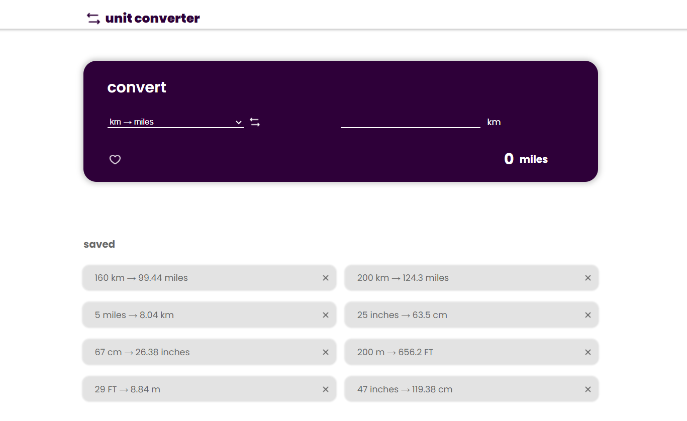

# pruebaNivel_Oxygen

[Página web](https://pruebanivel-oxygen.onrender.com/) 

Este proyecto es una prueba de nivel para Oxygen que tiene como objetivo valorar mis conocimientos y habilidades en el manejo de las tecnologías que conozco.

## Tecnologías utilizadas:
- React.js + Sass: maquetacióon Frontend
- React-redux: control del estado del conversor
- Node.js + Express: Backend API REST JSON
- ElephantSQL + pgadmin: creación y despliegue de la base de datos
- Docker + Render: despliegue de la página web

